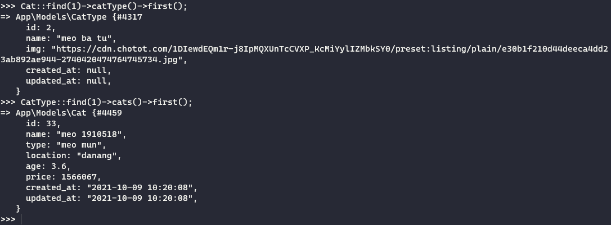

# Database

## Create sample table  

```bash
php artisan make:model Cat --migration
```

+ In file `database\migrations\...create_cats_table.php`, define table schema :  

```php
public function up()
{
    Schema::create('cats', function (Blueprint $table) {
        $table->id();
        $table->text('cat_id');
        $table->text('cat_type');
        $table->text('location');
        $table->float('age');
        $table->integer('price');
        $table->timestamps();
    });
}
```

### Seeder  

+ Init data :  

```bash
php artisan make:seeder CatSeeder
```

+ In file `database\seeders\CatSeeder.php`:  

```php
class CatSeeder extends Seeder
{
    /**
     * Run the database seeds.
     *
     * @return void
     */
    public function run()
    {
        DB::table('cats')->insert([
            'name' => Str::Random(10),
            'type' => 'meo mun',
            'location' => 'hanoi',
            'age' => 1,
            'price' => 1000000
        ]);

        DB::table('cats')->insert([
            'name' => Str::Random(10),
            'type' => 'meo ba tu',
            'location' => 'hanoi',
            'age' => 2,
            'price' => 2000000
        ]);
    }
}
```

+ Run seeder :  

```bash
php artisan db:seed 
php artisan db:seed --class=CatSeeder
```

### Factory  

```bash
php artisan make:factory CatFactory --model=Cat
```

+ In file `database\factories\CatFactory.php`:  

```php
public function definition()
{
    return [
        "name" => 'meo '.$this->faker->numberBetween(1000000, 2000000),
        'type' => $this->faker->randomElement(['meo mun', 'meo ba tu']),
        'location' => $this->faker->randomElement(['hanoi', 'hcm', 'danang']),
        'age' => $this->faker->randomFloat(1,0.1, 10),
        'price' => $this->faker->numberBetween(1000000, 2000000)
    ];
}
```

Add factory init into db seeder then run seeder again :  

```php
Cat::factory(10)->create(); // init 10 items
```

### Relations  

[Doc](https://laravel.com/docs/8.x/eloquent-relationships#one-to-one)  

For example, if you want to create a relationship between `Cat` and `CatType`. We will define a `one-to-many` relation ships.  

In model `Cat`, add method `catType` :  

```php
public function catType() {
    return $this->hasOne(CatType::class, 'name', 'type');
}
```

We create a match from `Cat` to `CatType` by `hasOne` :  

```php
return $this->hasOne(Phone::class, 'foreign_key', 'local_key');
```

We create a match from `CatType` to `Cat` by :  

```php
$this->belongsTo(User::class, 'foreign_key', 'owner_key');
```


