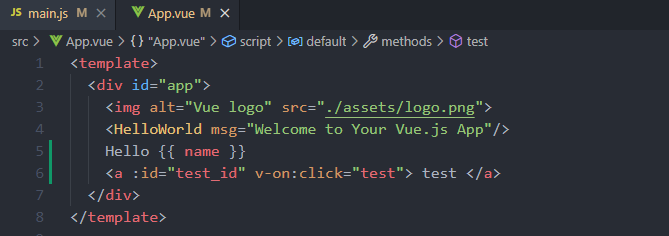

# Template  

In file `.vue`, we can define a tag `<template>` :  



Here, we can use some annotation to render by vue instance.  

## Tag {{ }}

We can write javascript expression in `{{ }}`.  
We can pass variable to template by using vue instance:  

+ data

## Directives  

Directives are special attributes with the `v-` prefix. It will be used by vue instance and do some magic 👌  

### v-if  

```html
<p v-if="variable"></p>
```

### v-bind  

We can set dynamic attribute for html tag :  

```html
<p v-bind:id="dynamic_id"></p>
```

+ Shorthands: 

```html
<p :id="dynamic_id"></p>
<p :href="url"></p>
```

### v-on  

```html
<a v-on:click="doSomething"></a>
<a @click="doSomething"></a>
```
