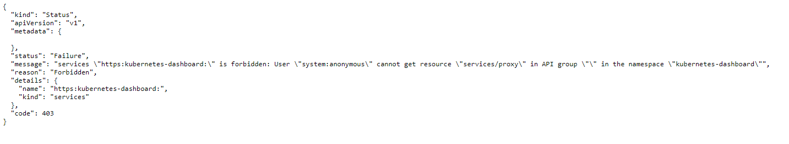

# Kubernetes Cluster Monitoring

## Kubernetes Dashboard

```bash
kubectl apply -f https://raw.githubusercontent.com/kubernetes/dashboard/v2.2.0/aio/deploy/recommended.yaml
```

Sau đó, truy cập vào dashboard thông qua master-ip lấy từ :

```bash
kubectl cluster-info
```

Ta sẽ được 1 link ELB của control plane. Sau đó, truy cập theo đường dẫn :  

```bash
/api/v1/namespaces/kube-system/services/https:kubernetes-dashboard:/proxy/
```

Ta sẽ dính lỗi 403 forbidden :  



Do khi truy cập vào đường link web mặc định sẽ là user `anonymous`. Ta cần cấp quyền cho nó.  

```bash
kubectl apply -f anonymous.yaml
```

Tiếp đến, namespace `kubernetes-dashboard` sẽ có quyền tối thiểu nhất, vì vậy nó không đủ quyền để xem metric của các namespace khác. Cũng cần cấp quyền cho nó:

```bash
kubectl apply -f dashboard_role.yaml
```

Tiếp đến, lấy token để login :  

```bash
kubectl get secret -n kubernetes-dashboard 
```

-> lấy token có type `kubernetes.io/service-account-token`.

```bash
kubectl describe secret <secret-name> -n kubernetes-dashboard 
```

## Heapster, InfluxDB and Grafana

`Heapster` là một bộ xử lí cùng tích hợp metrics. Nó thu thập tất cả các dữ liệu từ các containers bằng cách truy vấn tới `kubelet`. `kubelet` lại lấy dữ liệu từ `cAdvisor`. Toàn bộ dữ liệu này được lưu dữ tại `influxDB`. Tiếp đến, nó được mô phỏng hóa bằng `grafana` dashboard, hoặc là `kubernetes` dashboard.  
