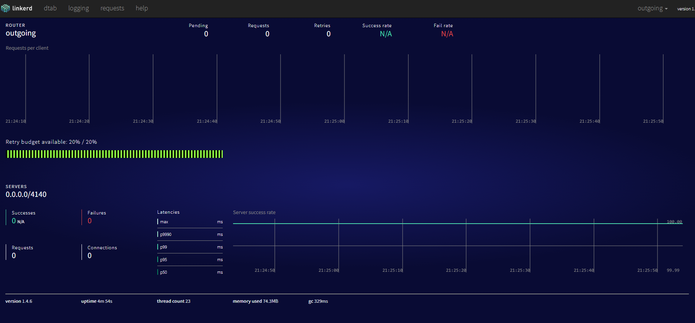
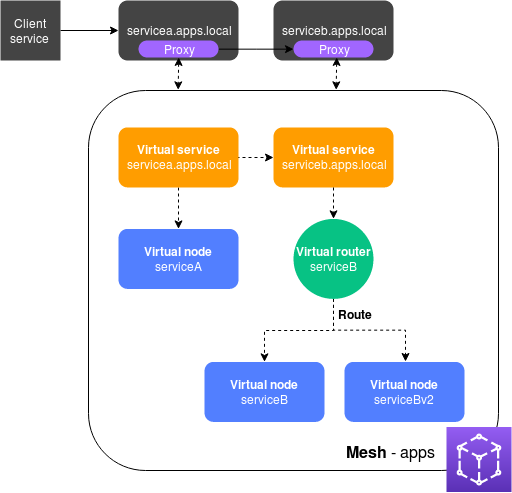
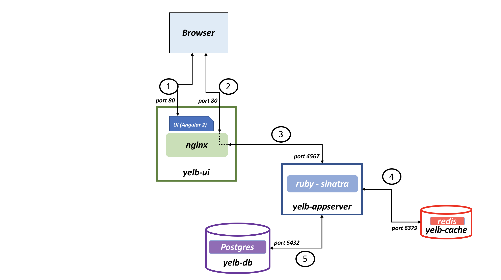
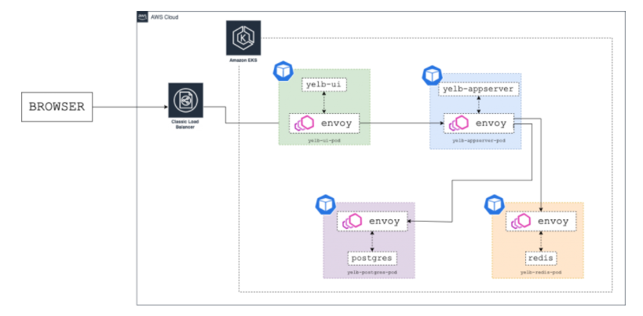
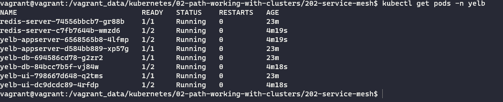
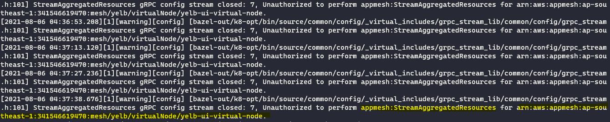
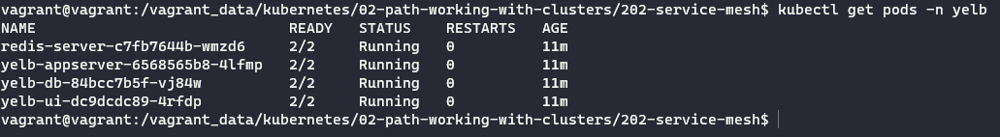

# Service Mesh  

Service mesh là một layer nhằm quản lí việc giao tiếp giữa các ứng dụng microservices và ngày càng trở nên phổ biến trong các ứng dụng cloud.
Một trong những ứng dụng quan trọng là :  

+ Service discovery
+ Load balancing
+ Automatic retries
+ circuit-breaking : ngắt khi lượng request fail vượt ngưỡng
+ Thu thập dữ liệu về các metrics, tracing

## Linkerd with Kubernetes  

Trong ví dụ này, ta tập trung nghiên cứu cách `Linkerd` phát hiện các service có trong cluster.  

### Install linkerd  

Download phiên bản `Daemon Set` của linkerd từ [github](https://raw.githubusercontent.com/linkerd/linkerd-examples/master/k8s-daemonset/k8s/linkerd.yml).  

Sửa đổi một chút theo phiên bản của kubectl mới -> install.  

Lấy link ELB của linkerd :  

```bash
LINKERD_ELB=$(kubectl get svc l5d -o jsonpath="{.status.loadBalancer.ingress[0].*}")
```

Sau đó, truy cập vào địa chỉ :  

```bash
https://LINKERD_ELB:9990
```

  

## AWS Appmesh

### Basic concepts



+ `Service Mesh`: `Mesh` là một lớp logic ảo bao quanh toàn bộ hạ tầng mạng mà các ứng dụng microservices cần sử dụng.  
+ `Virtual Service`: là một lớp ảo của ứng dụng và là tên gọi ứng dụng . Các ứng dụng giao tiếp với nhau thông qua `virtualServiceName`, các request sau đó sẽ được gửi tới `virtual node` hoặc `virtual router`.  
+ `Virtual Routers`: xử lí traffics dựa trên các luật khác nhau, phải có ít nhất 1 nodes. Luật routing có thể dựa trên HTTP header, URL path, gRPC service, method.
+ `Virtual Nodes`: Mỗi services sẽ có ít nhất 1 `Nodes`. Là một con trỏ ảo tới service thật sự.

### Install Appmesh Controllers

Thêm helm repo :  

```bash
helm repo add eks https://aws.github.io/eks-charts
```

+ Khởi tạo namespace và tạo service account:  

```bash
kubectl create ns appmesh-system

# Create your OIDC identity provider for the cluster
eksctl utils associate-iam-oidc-provider \
  --cluster fargate \
  --approve

# Create an IAM role for the appmesh-controller service account
eksctl create iamserviceaccount \
  --cluster fargate \
  --namespace appmesh-system \
  --name appmesh-controller \
  --attach-policy-arn  arn:aws:iam::aws:policy/AWSCloudMapFullAccess,arn:aws:iam::aws:policy/AWSAppMeshFullAccess \
  --override-existing-serviceaccounts \
  --approve
```

+ Install bằng helm:  

```bash
helm upgrade -i appmesh-controller eks/appmesh-controller \
  --namespace appmesh-system \
  --set region=${AWS_REGION} \
  --set serviceAccount.create=false \
  --set serviceAccount.name=appmesh-controller
```

### Khởi chạy ứng dụng Yelb thông thường



```bash
kubectl apply -f yelb_init.yml
```

Đây là 1 ứng dụng vote đơn giản bao gồm có 4 thành phần chính:

+ yelb_ui
+ yelb_appserver
+ yelb_db
+ yelb_cache

Hiện tại chúng đang giao tiếp với nhau qua localhost, có thể truy cập vào UI qua LoadBalancer.

### Tích hợp AppMesh

Nhiệm vụ khi tích hợp appmesh sẽ là với mỗi service như trên, tạo một `virtual node` để chạy các service. Khi đó, mesh sẽ inject 1 container `envoy` cho mỗi pod của service làm proxy để quản lí, kiểm soát các request vào, ra containers.



[Envoy](https://blog.christianposta.com/microservices/00-microservices-patterns-with-envoy-proxy-series/) là một ứng dụng nhỏ, nhẹ viết bằng C++ có các công dụng của mesh như sau:  

+ Service discovery
+ Adaptive routing / client side load balancing
+ Automatic retries
+ Circuit breakers
+ Timeout controls
+ back pressure
+ Rate limiting
+ Metrics/stats collection
+ Tracing
+ request shadowing
+ Service refactoring / request shadowing
+ TLS between services
+ Forced service isolation / outlier detection

Để mesh biết được rằng những pod nào cần phải inject `envoy` proxy, ta sẽ đánh nhãn cho namespace:  

```bash
kubectl label namespace yelb mesh=yelb
kubectl label namespace yelb appmesh.k8s.aws/sidecarInjectorWebhook=enabled
```

Các nhãn này sẽ hướng dẫn mesh controller thêm `envoy` proxy vào cho từng pod.  
Sau đó, tạo `Mesh`:  

```yaml
apiVersion: appmesh.k8s.aws/v1beta2
kind: Mesh
metadata:
  name: yelb
spec:
  namespaceSelector:
    matchLabels:
      mesh: yelb
```

```bash
kubectl apply -f mesh.yaml
```

Mesh này sẽ tiến hành quản lí những namespace có nhãn là `mesh:yelb`.  

Cuối cùng, tạo `virtual node`, `virtual service`, `virtual router`.  

```bash
kubectl apply -f yelb
```

Khởi động lại các deployments.  

```bash
kubectl -n yelb rollout restart deployment
```



Ta thấy pod hiện tại sẽ gồm 2 containers. Tuy nhiên containers `envoy` hiện tại đang khởi chạy fail. Xem log của `envoy`.  

```bash
 kubectl -n yelb logs <pod-name> -c envoy
```



Containers envoy đang bị thiếu quyền truy cập tới appmesh. Tại đây, có 2 hướng xử lí:

+ Thêm service account cho pod
+ Thêm role cho node group

Sau đó, envoy sẽ kết nối thành công tới mesh :  



### Sơ lược cách hoạt động của AppMesh

+ `Virtual Node`

Virtual Node tiến hành quản lí các pod có label là `app=yelb-ui`.

```yaml
podSelector:
  matchLabels:
    app: yelb-ui
```

Lắng nghe cổng 80 của containers.

```yaml
listeners:
  - portMapping:
      port: 80
      protocol: http 
```

Kết nối tới service của pod nhờ dns :  

```yaml
serviceDiscovery:
  dns:
    hostname: yelb-ui.yelb.svc.cluster.local
```

Tên của DNS tuân theo chuẩn định dạng DNS của kubernetes.

Điều khiển các outbound traffic thông qua backend :  

```yaml
backends:
  - virtualService:
      virtualServiceRef:
        name: yelb-appserver
```

+ `Virtual Service`:  

Kết nối tới `Virtual node` hoặc `virtual router`.  

```yaml
provider:
  virtualNode:
    virtualNodeRef:
      name: yelb-ui
```

```yaml
provider:
  virtualRouter:
      virtualRouterRef:
          name: yelb-appserver
```

+ `Virtual Router`:

```yaml
listeners:
  - portMapping:
      port: 4567
      protocol: http
```

Luật routes:  

```yaml
routes:
  - name: route-to-yelb-appserver
    httpRoute:
      match:
        prefix: /
      action:
        weightedTargets:
          - virtualNodeRef: 
              name: yelb-appserver
            weight: 1
      retryPolicy:
          maxRetries: 2
          perRetryTimeout:
              unit: ms
              value: 2000
          httpRetryEvents:
              - server-error
              - client-error
              - gateway-error
```

### Enable X-Ray

Thêm 2 options khi install appmesh-controller:  

```bash
--set tracing.enabled=true
--set tracing.provider=x-ray
```
