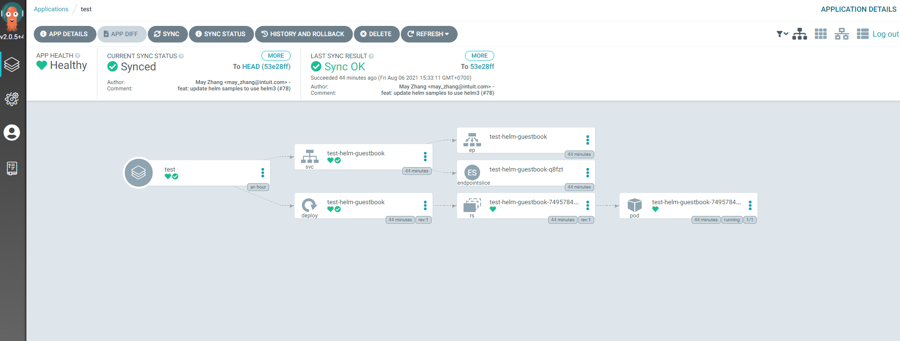
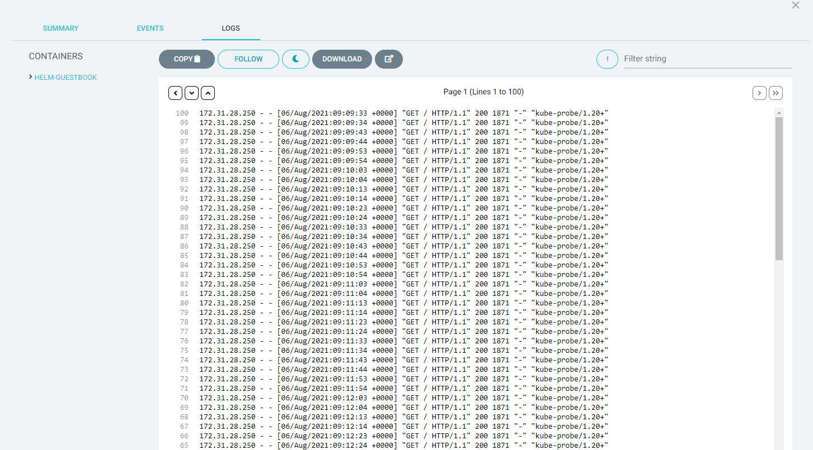

# Argo CD

Một công cụ deploy tự động dành cho kubernetes.
Nó có thể được sử dụng để deploy một ứng dụng kubernetes từ 1 folder của repo github. Các loại cấu hình mà `ArgoCD` có thể deploy được:

+ kustomize
+ helm chart
+ ksonnet
+ jsonnet
+ file yaml

Nó cũng theo dõi branch, tags của git để tự động deploy.

## Install  

+ Install trên kubernetes:

```bash
kubectl create namespace argocd
kubectl apply -n argocd -f https://raw.githubusercontent.com/argoproj/argo-cd/stable/manifests/install.yaml
```

+ Install cli :

```bash
sudo curl -sSL -o /usr/local/bin/argocd https://github.com/argoproj/argo-cd/releases/latest/download/argocd-linux-amd64
sudo chmod +x /usr/local/bin/argocd
```

## Truy cập UI web

Expose service :  

```bash
kubectl patch svc argocd-server -n argocd -p '{"spec": {"type": "LoadBalancer"}}'
```

Sau đó, truy cập theo link load balancer nhận được.

+ Lấy password với username mặc định là `admin`:

```bash
kubectl -n argocd get secret argocd-initial-admin-secret -o jsonpath="{.data.password}" | base64 -d
```

Tiếp đến, để có thể sử dụng `argocd` cli, ta cần kết nối nó tới `argocd` trên kubernetes:  

```bash
argocd login <ARGOCD_SERVER_ELB>
```

Có thể thay đổi password bằng lệnh:  

```bash
argocd account update-password
```

## Kết nối EKS và argoCD

Liệt kê các cluster context hiện có:  

```bash
kubectl config get-contexts -o name
```

Thêm cluster vào argocd :  

```bash
argocd cluster add <kube-context>
```

## Tạo ứng dụng mẫu  

Làm theo [hướng dẫn](https://argoproj.github.io/argo-cd/getting_started/).



Thậm chí có thể xem được cả logs trên giao diện argocd:  



